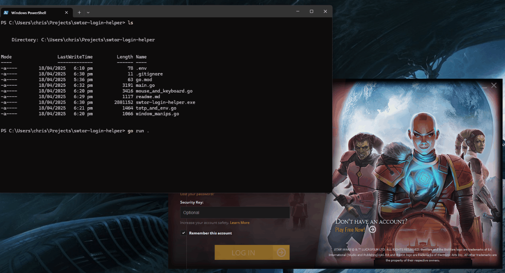

# SWTOR Launcher Helper

I got sick of having to enter my password and OTP every time I start the game on my gaming PC which is safely locked inside my house - so I automated it.

Note this is NOT SAFE™ as it requires your password and OTP secret be in a locally stored file named `.env` - the password is bad enough, but the OTP secret by definition means you're MFA is replicated in more than one location which is "bad news" - ensure you keep that secret as secure as you keep your phone - and by being in the same location as the password, its no longer technically 'multi-factor'.

> if you are ignoring the above warning, the secret can be extracted from the QR code that SWTOR presents when you on-board a security key. If you already have a key, you will need to unregister and re-register to get this QR code.

Other than that though, its all good. Finds the window by its title using the w32 api, then uses the api to move the mouse and send text codes before clicking login:

Use:

1. create the .env file, with the fields USERNAME=,PASSWORD= and OTPSECRET=
2. start the launcher
3. run this program

## Notes

- if you move the mouse while it is running, you might break its automation.
- by default, it won't do anything with the username as the launcher will actually remember that
- if you are paranoid note that no external packages are used, just the base go library. what is in the repo is what you get
  - also you will need to compile it yourself. fortunately that should just be `go build .` (assuming you have golang installed)
